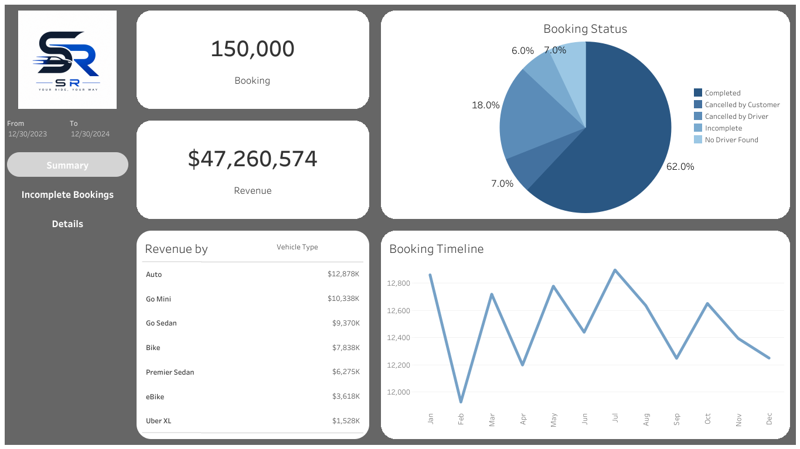
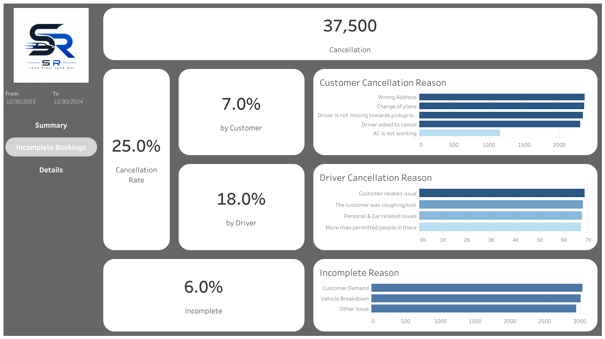
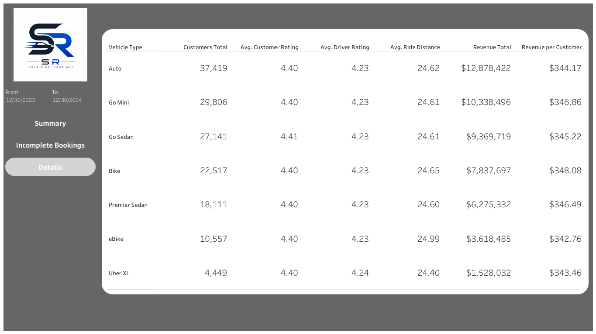

# Sales Performance & Revenue Analysis

## Overview

This project analyzes ride booking data to evaluate revenue performance, service reliability, and operational efficiency. Using SQL and Tableau, the analysis simulates real-world business monitoring for a transportation platform.

The goal is to identify revenue drivers, understand booking outcomes, and uncover operational issues that impact customer experience and business performance.

---

## Dashboard

https://public.tableau.com/app/profile/shu.richardson/viz/SalesPerformanceandRevenueAnalysis/Summary





---

## Business Problem

Transportation platforms must continuously monitor:

- Revenue performance
- Booking success rates
- Operational failures (cancellations, incomplete rides)
- Customer experience

Without clear visibility, businesses risk revenue loss, poor service quality, and reduced customer retention.

---

## Key Metrics

- Total Bookings  
- Total Revenue  
- Completion Rate  
- Cancellation Rate  
- Incomplete Rate  
- Average Ride Distance  
- Customer & Driver Ratings  

---

## Dashboard Analysis

### 1. Summary

- Total bookings and total revenue
- Booking status distribution (Completed, Cancelled, Incomplete)
- Revenue by vehicle type and payment method
- Monthly booking and revenue trends

**Business Value:** Provides a high-level view of performance and identifies revenue drivers.

---

### 2. Incomplete & Cancellation Analysis

- Total cancellations and cancellation rate
- Customer vs. driver cancellations
- Customer cancellation reasons
- Driver cancellation reasons
- Incomplete ride rate and reasons

**Business Value:** Identifies operational inefficiencies and root causes of failed bookings.

---

### 3. Vehicle-Level Performance (Detailed Table)

Metrics analyzed by vehicle type:

- Total customers  
- Average customer rating  
- Average driver rating  
- Average ride distance  
- Total revenue  
- Revenue per customer  

**Business Value:** Highlights high-performing and underperforming service segments.

---

## Dataset

- ~150,000 ride booking records  
- Multiple booking outcomes (Completed, Cancelled, Incomplete)  
- Revenue, distance, and rating data  
- Customer and driver behavior indicators  

---

## Tools Used

- SQL  
- Tableau  
- Excel / CSV  

---

## Key Insights

- Certain vehicle types contribute disproportionately to total revenue  
- Cancellations and incomplete rides significantly impact operational efficiency  
- Customer and driver ratings vary across service types  
- Revenue trends fluctuate based on demand and booking volume  

---

## Repository Structure

```
sales-performance-revenue-analysis
│
├── data
│ └── ncr_ride_bookings.csv
│
├── images
│ └── dashboard_summary.png
│ └── dashboard_incompleteBookings.png
│ └── dashboard_details.png
│
├── sales_performance_revenue_analysis.twbx
└── README.md
```

---

## Skills Demonstrated

- KPI development and performance tracking  
- Revenue and trend analysis  
- Operational performance monitoring  
- Root cause analysis (cancellations & failures)  
- Data visualization and dashboard design  

---

## Future Enhancements

- Revenue forecasting (time-series analysis)  
- Peak demand and surge analysis  
- Geographic performance analysis (pickup/drop hotspots)  
- Customer segmentation (high-value vs. low-value users)  
- Improve reporting accuracy by extending time granularity (Month/Day-level analysis)  
