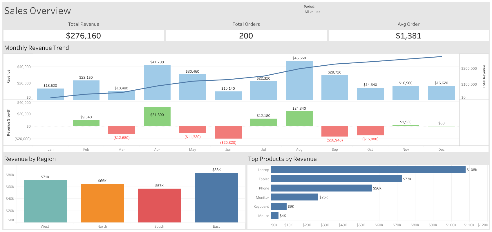

# Sales Performance Analysis (SQL)

## Project Overview

This project analyzes sales performance across regions, products, and time periods to identify revenue trends, evaluate operational performance, and support data-driven business decisions.

The objective is to simulate a real-world business scenario where leadership needs visibility into key performance indicators (KPIs) such as revenue growth, regional performance, and product demand. The analysis demonstrates how structured data can be transformed into actionable insights using SQL and data visualization techniques.

---

## Dashboard Preview



---

## Business Problem

Organizations rely on accurate sales data to monitor performance, forecast demand, and identify growth opportunities. Without clear reporting and analysis, it becomes difficult to understand which products drive revenue, which regions underperform, and how sales trends change over time.

This project answers key business questions such as:

* How has revenue changed over time?
* Which regions generate the most revenue?
* What are the top-performing products?
* What is the average order value?
* Are sales increasing or declining?

---

## Dataset Description

The dataset represents transactional sales data for a retail business.

### Key Fields

| Column Name | Description                      |
| ----------- | -------------------------------- |
| order_id    | Unique identifier for each order |
| order_date  | Date of transaction              |
| region      | Geographic sales region          |
| product     | Product name                     |
| quantity    | Number of units sold             |
| unit_price  | Price per unit                   |
| revenue     | Total revenue for the order      |
| customer_id | Unique customer identifier       |

---

## Tools and Technologies

* SQL
* Excel
* Data Visualization – Tableau
* GitHub

---

## Project Structure

sales-performance-analysis/

README.md  
sales_performance_analysis.sql
data/

```
sample_sales_data.csv  
```

visualizations/

```
revenue_trend_chart.png  
regional_sales_chart.png  
```

outputs/

```
sales_summary_report.xlsx  
```

---

## Key Performance Indicators (KPIs)

This analysis focuses on commonly used business metrics:

* Total Revenue
* Monthly Revenue Trend
* Revenue by Region
* Revenue by Product
* Average Order Value
* Sales Growth Rate

These KPIs are widely used in business intelligence and performance monitoring environments.

---

## SQL Analysis

### Total Revenue

```sql
SELECT
    SUM(revenue) AS total_revenue
FROM sales;
```

---

### Revenue by Region

```sql
SELECT
    region,
    SUM(revenue) AS total_revenue
FROM sales
GROUP BY region
ORDER BY total_revenue DESC;
```

---

### Monthly Revenue Trend

```sql
SELECT
    DATE_TRUNC('month', order_date) AS month,
    SUM(revenue) AS monthly_revenue
FROM sales
GROUP BY month
ORDER BY month;
```

---

### Top Performing Products

```sql
SELECT
    product,
    SUM(revenue) AS total_revenue
FROM sales
GROUP BY product
ORDER BY total_revenue DESC
LIMIT 10;
```

---

### Average Order Value

```sql
SELECT
    AVG(revenue) AS average_order_value
FROM sales;
```

---

## Example Insights

The following insights demonstrate how data analysis can support business decision-making:

* Revenue increased steadily during the first half of the year before stabilizing in later months
* The West region generated the highest total revenue
* A small number of products accounted for a significant portion of total sales
* Average order value remained consistent across most regions
* Seasonal demand patterns were observed during peak months

---

## Business Recommendations

Based on the analysis, potential business actions may include:

* Increase inventory planning for high-performing products
* Investigate underperforming regions for operational improvements
* Launch targeted promotions during peak demand periods
* Monitor revenue trends to support forecasting and budgeting
* Optimize pricing strategies to maximize revenue and margin

---

## What This Project Demonstrates

This project showcases core data analyst capabilities, including:

* Writing SQL queries to analyze business data
* Developing key performance indicators (KPIs)
* Identifying trends and performance drivers
* Translating data into business insights
* Supporting data-driven decision-making
* Communicating findings clearly

---

## Next Steps

Potential enhancements for this project:

* Add customer segmentation analysis
* Perform sales forecasting
* Automate reporting workflows
* Integrate additional datasets
